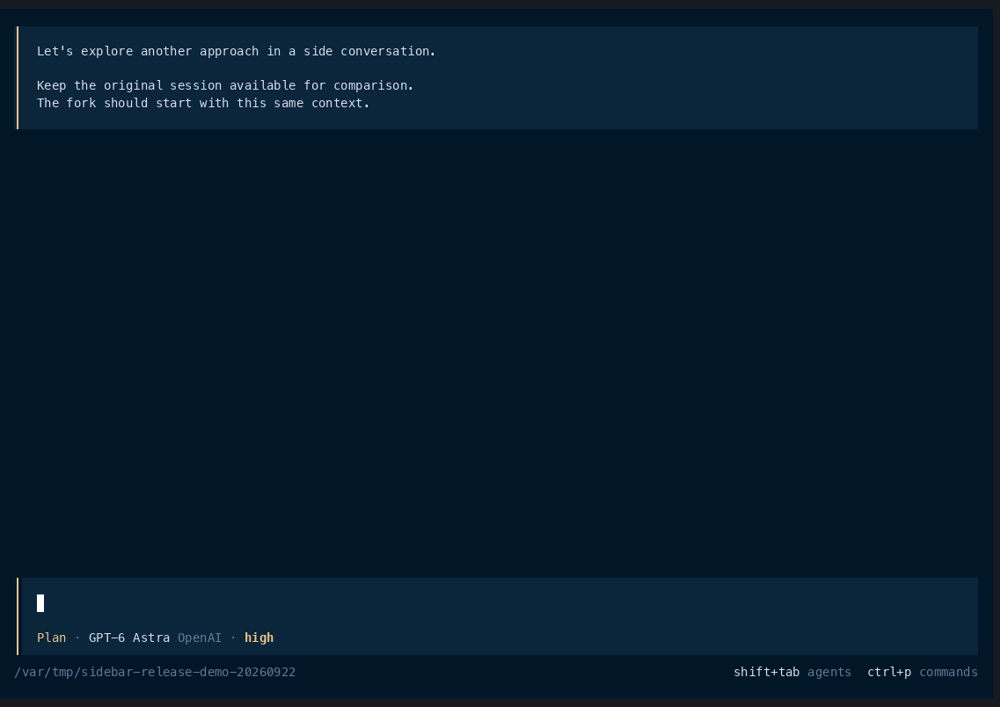

# OpenCode Herdr Sidebar

[](https://github.com/mcostasilva/opencode-herdr-sidebar/actions/workflows/ci.yml)
[](LICENSE)
[](Cargo.toml)

**Branch your OpenCode conversation without losing your place.**

One shortcut forks it into a right-hand Herdr pane. Press again to return to it.



*Recorded live: fork while the main agent researches Herdr, ask a side question in the fork, then return with the shortcut. Both conversations keep their own history. Waiting and streaming condensed.*

A small Rust plugin for [Herdr](https://herdr.dev), built for OpenCode V2.

## Install

Requires **Herdr 0.9.1+**, **OpenCode V2**, and **Rust/Cargo 1.89+** on macOS or
Linux. Herdr's OpenCode integration must report the current session ID.

```sh
herdr plugin install mcostasilva/opencode-herdr-sidebar
```

Herdr builds the binary from source. To pin a release, append `--ref v0.1.0`.

Add this binding to `~/.config/herdr/config.toml`:

```toml
[[keys.command]]
key = "prefix+f"
type = "plugin_action"
command = "opencode-sidebar.open"
description = "fork or focus OpenCode side pane"
```

```sh
herdr config check
herdr server reload-config
```

With Herdr's default prefix, press **Ctrl+B**, then **F**. Choose another binding
if you already use that combination.

## How it behaves

| When you press the shortcut | Result |
| --- | --- |
| First time in an OpenCode pane | Fork the exact current session, open a right-hand split, and focus it |
| Again in the source pane | Focus its existing side pane |
| Inside the side pane | Keep focus there |
| After closing the side pane | Create a fresh fork |

- The fork inherits conversation history and the active agent/model.
- Both conversations use the same working directory and files.
- Each source pane has its own side pane, including when several agents share a directory.
- No prompt is automatically submitted to the fork.
- The source needs saved conversation history; OpenCode cannot fork an empty session.
- Switching conversations in the source pane still returns to its existing side pane.
- Closing a pane keeps the conversation in OpenCode's session history.

You can also invoke the action from Herdr:

```sh
herdr plugin action invoke opencode-sidebar.open
```

## Compatibility

| Component | Support |
| --- | --- |
| Operating systems | macOS and Linux |
| Herdr | 0.9.1 or newer |
| OpenCode | V2; verified with 2.0.11 and 2.0.12 |
| Connection | Shared local service or an explicit `--server` argument |
| Rust | 1.89 or newer, required to build |

Private `--standalone` servers, custom executable names/wrappers, and environment
overrides set only in the source shell are not supported yet. Explicit server URLs
are carried into both the API calls and the new terminal; server authentication
must be available to processes launched by Herdr.

## Reliability and recovery

The plugin uses the session ID reported by Herdr. It waits for the side pane to
report the expected fork before completing. Concurrent invocations share a file
lock, and command, lock, and startup waits default to **30 seconds** each.

Mappings and pending operations are stored in Herdr's plugin state directory.
Writes use atomic replacement. Existing mappings from the initial prototype are
upgraded automatically. Pane and terminal identities prevent recycled IDs from
redirecting a shortcut to an unrelated terminal.

If an action fails, inspect its log:

```sh
herdr plugin log list --plugin opencode-sidebar --limit 5
```

**Usually, invoke the shortcut again.** A saved fork or recognizable pane is reused.
A lost fork response is ambiguous: OpenCode may have created the session even though
the CLI did not receive its ID. The plugin records this and does not fork again
automatically.

For manual recovery, run the binary from inside the source pane with
`HERDR_PLUGIN_STATE_DIR` set to the same directory Herdr uses for this plugin
(normally `$XDG_STATE_HOME/herdr/plugins/opencode-sidebar`, or
`~/.local/state/herdr/plugins/opencode-sidebar`):

```sh
export HERDR_PLUGIN_STATE_DIR="${XDG_STATE_HOME:-$HOME/.local/state}/herdr/plugins/opencode-sidebar"

# After finding the fork in OpenCode's session history:
/path/to/plugin/target/release/opencode-herdr-sidebar open --recover-session ses_ID

# After confirming a failed pane launch created no pane:
/path/to/plugin/target/release/opencode-herdr-sidebar open --retry-launch

# After confirming a failed fork request created no session:
/path/to/plugin/target/release/opencode-herdr-sidebar open --retry-fork
```

Let outstanding requests settle before using the explicit retry options. The plugin
validates a recovery session's parent and directory. It never deletes conversations
as part of recovery. For slow startup, set `OPENCODE_SIDEBAR_TIMEOUT_MS` in the
environment used to launch Herdr.

## Development

```sh
git clone https://github.com/mcostasilva/opencode-herdr-sidebar.git
cd opencode-herdr-sidebar
cargo build --release --locked --target-dir target
herdr plugin link "$PWD"
```

See [CONTRIBUTING.md](CONTRIBUTING.md) for tests, architecture, and release steps.
The automated tests use isolated fixtures and do not require live agents.

## Uninstall

Remove the keybinding, reload Herdr's configuration, and run:

```sh
herdr plugin uninstall opencode-sidebar
```

For a local development checkout, use `herdr plugin unlink opencode-sidebar`.

## License

[MIT](LICENSE) © 2026 Marcio Costa Silva.
